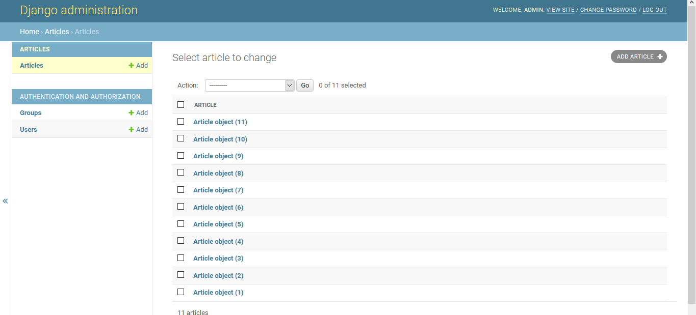
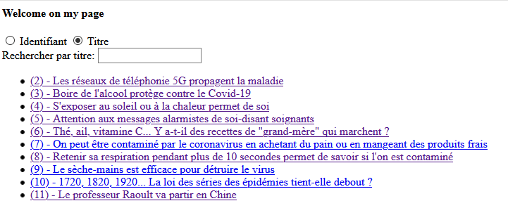
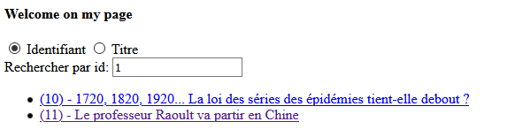
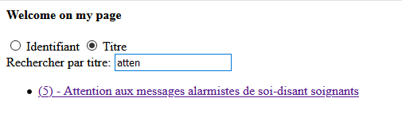
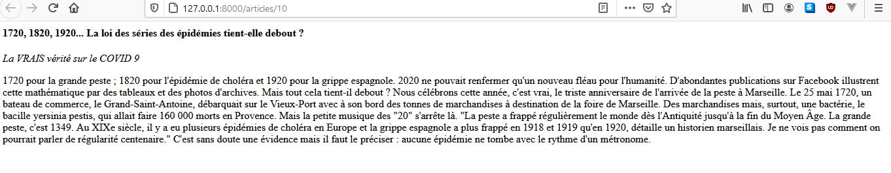

# Rimbobobo

## Pré requis
* installer le [requirement.txt](requirements.txt)

## Exécution
* vscode (launch.json fournit pour le débuggage vscode)
* en ligne de commande:
     ``` python
     python manage.py runserver
     ```

## Fonctionnalités
### Administration

* Les articles s'administrent dans [la page admin](http://127.0.0.1:8000/admin/) . Le login / passowrd a été fournit dans simplonline
  * CRUD sur les articles
  * Création de users et affectation des privilèges
 
---

### Homepage

* Affichage des articles [ici](http://127.0.0.1:8000/all/):
  * affichage des articles non perimés (end_date<today > __lt vs __lte c'est maitrisé!)
  * affichage des articles resérvés aux admins si session admin ouverte
 
---

### Filtres
* Rechercher des articles:
    * filtre par id ou alors recherche partielle dans le titre de l'article. 
    * pour une recherche dans le titre, au moins 3 caractères!
    * Si pas de match, pas de résultat. Si filtre vide, tous les résultats
 
---

### Recherche par ID

 
---

### Recherche par Titre


---

### Page de détail

* l'url des détails d'article est **http://127.0.0.1:8000/XXX** où XXX correspond à l'id de l'article 

---

## Technique
* base de donnée hebergée sur [ElephantSQL](https://www.elephantsql.com/)

---

## Azure
* pas de compte, pas de déploiement
